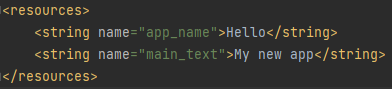

# Rapport

**Skriv din rapport här!**

För att ändra labeln på applikationen behöver stringen android:label i "AndroidManifest.xml" ändras, och
även text stringen i layouten.

För att behålla namnet på appen men ändå ändra texten skapades en ny string i "strings.xml" filen:


För att inte hardcoda en string länkas till stringen:
```
@string/main_text
```

Slutgiltiga appen ser som som sådan:

_Du kan ta bort all text som finns sedan tidigare_.

## Följande grundsyn gäller dugga-svar:

- Ett kortfattat svar är att föredra. Svar som är längre än en sida text (skärmdumpar och programkod exkluderat) är onödigt långt.
- Svaret skall ha minst en snutt programkod.
- Svaret skall inkludera en kort övergripande förklarande text som redogör för vad respektive snutt programkod gör eller som svarar på annan teorifråga.
- Svaret skall ha minst en skärmdump. Skärmdumpar skall illustrera exekvering av relevant programkod. Eventuell text i skärmdumpar måste vara läsbar.
- I de fall detta efterfrågas, dela upp delar av ditt svar i för- och nackdelar. Dina för- respektive nackdelar skall vara i form av punktlistor med kortare stycken (3-4 meningar).