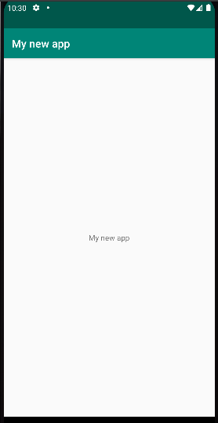

# Rapport

För att ändra labeln på applikationen behöver stringen android:label i "AndroidManifest.xml" ändras, och
även text stringen i layouten.

För att behålla namnet på appen men ändå ändra texten skapades en ny string i "strings.xml" filen:
```
<resources>
    <string name="app_name">Hello</string>
    <string name="main_text">My new app</string>
</resources>
```


För att inte hardcoda en string länkas till stringen:
```
@string/main_text
```

Slutgiltiga appen ser som som sådan:

